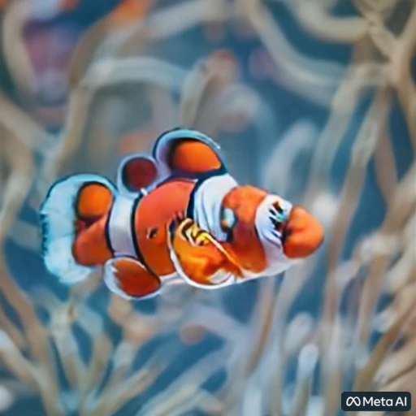
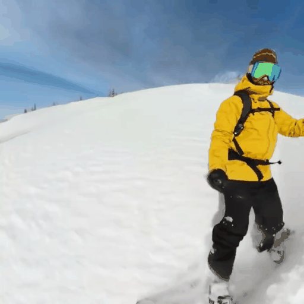
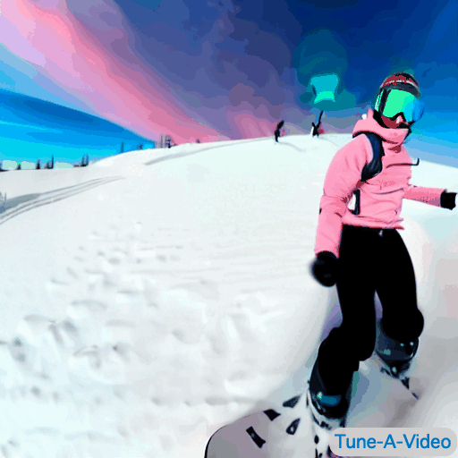
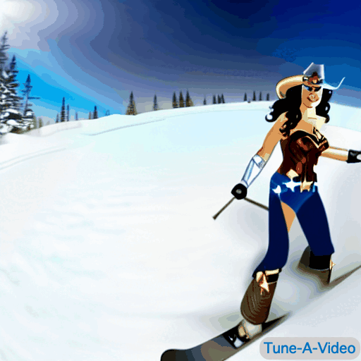
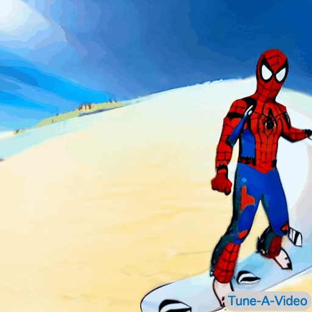

# [A Survey on Video Diffusion Models](https://arxiv.org/abs/2310.10647) [](https://github.com/sindresorhus/awesome)  [](https://arxiv.org/abs/2310.10647) 


<div style="text-align:center; font-size: 18px;">
    <p>
    <a href="https://chenhsing.github.io">Zhen Xing</a>, 
    Qijun Feng,
    Haoran Chen,
    <a href="https://scholar.google.com/citations?user=NSJY12IAAAAJ&hl=zh-CN" >Qi Dai,</a>
    <a href="https://scholar.google.com/citations?user=Jkss014AAAAJ&hl=zh-CN&oi=ao" >Han Hu,</a>
    <a href="https://scholar.google.com/citations?user=J_8TX6sAAAAJ&hl=zh-CN&oi=ao" >Hang Xu,</a>
    <a href="https://scholar.google.com/citations?user=7t12hVkAAAAJ&hl=en" >Zuxuan Wu,</a>
    <a href="https://scholar.google.com/citations?user=f3_FP8AAAAAJ&hl=en" >Yu-Gang Jiang </a>
     </p>
</div>


<p align="center">

    
    
</p>


<p align="center">
  
  
</p>


<p align="center">




</p>


<p align="center">
(Source: <a href="https://makeavideo.studio/">Make-A-Video</a>, <a href="https://chenhsing.github.io/SimDA/">SimDA</a>, <a href="https://research.nvidia.com/labs/dir/pyoco/">PYoCo</a>, <a href="https://img.shields.io/badge/Website-9cf"> SVD </a>,
<a href="https://research.nvidia.com/labs/toronto-ai/VideoLDM/">Video LDM</a> and <a href="https://tuneavideo.github.io/">Tune-A-Video</a>)
</p>


- [News] <span style="color:red;"> **We are planning to update the survey soon to encompass the latest work. If you have any suggestions, please feel free to contact us.**</span>
- [News] The Chinese translation is available on [Zhihu](https://zhuanlan.zhihu.com/p/661860981). Special thanks to [Dai-Wenxun](https://github.com/Dai-Wenxun) for this.


## Open-source Toolboxes and Foundation Models 

| Methods | Task | Github|
|:-----:|:-----:|:-----:|
| [Morph Studio](https://app.morphstudio.com/)  | T2V Generation | -|
| [Genie](https://sites.google.com/view/genie-2024/home)  | T2V Generation | -|
| [Sora](https://openai.com/sora)  | T2V Generation & Editing | -|
| [VideoPoet](https://blog.research.google/2023/12/videopoet-large-language-model-for-zero.html)  | T2V Generation & Editing | -|
| [Stable Video Diffusion](https://stability.ai/news/stable-video-diffusion-open-ai-video-model)  | T2V Generation | [](https://github.com/Stability-AI/generative-models)|
| [NeverEnds](https://neverends.life)   | T2V Generation | - |
| [Pika](https://pika.art)   | T2V Generation | - |
| [EMU-Video](https://emu-video.metademolab.com/)   | T2V Generation | - |
| [GEN-2](https://app.runwayml.com/)   | T2V Generation & Editing | - |
| [ModelScope](https://modelscope.cn/models/damo/text-to-video-synthesis/summary)  | T2V Generation | [](https://github.com/modelscope/modelscope) |
| [ZeroScope](https://easywithai.com/ai-video-generators/zeroscope/)  | T2V Generation | -|
| [T2V Synthesis Colab](https://github.com/camenduru/text-to-video-synthesis-colab) | T2V Genetation |[](https://github.com/camenduru/text-to-video-synthesis-colab)|
| [VideoCraft](https://github.com/VideoCrafter/VideoCrafter) | T2V Genetation & Editing |[](https://github.com/VideoCrafter/VideoCrafter)|
| [Diffusers (T2V synthesis)](https://huggingface.co/docs/diffusers/main/en/api/pipelines/text_to_video#texttovideo-synthesis) | T2V Genetation |-|
| [AnimateDiff](https://github.com/guoyww/AnimateDiff) | Personalized T2V Genetation |[](https://github.com/guoyww/AnimateDiff)|
| [Text2Video-Zero](https://github.com/Picsart-AI-Research/Text2Video-Zero) |  T2V Genetation |[](https://github.com/Picsart-AI-Research/Text2Video-Zero)|
| [HotShot-XL](https://github.com/hotshotco/Hotshot-XL) |  T2V Genetation |[](https://github.com/hotshotco/Hotshot-XL)|
| [Genmo](https://www.genmo.ai/) |  T2V Genetation |-|
| [Fliki](https://fliki.ai/) | T2V Generation | -|


## Table of Contents 

- [Video Generation](#video-generation)
- - [Data](#data)
- - - [Caption-level](#caption-level)
- - - [Category-level](#category-level)
- - [T2V Generation](#text-to-video-generation)
- - - [Training-based](#training-based)
- - - [Training-free](#training-free)
- - [Video Generation with other Condtions](#modality-control-video-generation)
- - - [Pose-gudied](#pose-guided-video-generation)
- - - [Instruct-guided](#instruct-guided-video-generation)
- - - [Sound-guided](#sound-guided-video-generation)
- - - [Brain-guided](#brain-guided-video-generation)
- - - [Multi-Modal guided](#multi-modal-guided-video-generation)
- - [Unconditional Video Generation](#domain-specific-video-generation)
- - - [U-Net based](#category-specific)
- - - [Transformer-based](#personalized-video)
- - [Video Completion](#video-completion)
- - - [Video Enhance and Restoration](#video-enhancement-and-restoration)
- - - [Video Prediction](#video-prediction)
- [Video Editing](#video-editing)
- - [Text guided Video Editing](#text-guided-video-editing)
- - - [Training-based Editing](#general-editing-model)
- - - [One-shot Editing](#one-shot-editing-model)
- - - [Traning-free](#training-free-editing-model)
- - [Modality-guided Video Editing](#modality-guided)
- - - [Motion-guided](#motion-guided-editing-model)
- - - [Instruct-guided](#instruct-guided-editing-model)
- - - [Sound-guided](#sound-guided-editing-model)
- - - [Multi-Modal Control](#multi-modal-control-editing-model)
- - [Domain-specific editing](#domain-specific-editing-model)
- - [Non-diffusion editing](#non-diffusion-editing-Model)
- [Video Understanding](#video-understanding)
- [Contact](#Contact)


# Video Generation

## Data 

### Caption-level

| Title | arXiv | Github| WebSite | Pub. & Date
|:-----:|:-----:|:-----:|:-----:|:-----:|
|[CelebV-Text: A Large-Scale Facial Text-Video Dataset](https://arxiv.org/pdf/2303.14717.pdf)|  [](https://arxiv.org/pdf/2303.14717.pdf) |   [](https://github.com/CelebV-Text/CelebV-Text) | - | CVPR, 2023
|[InternVid: A Large-scale Video-Text Dataset for Multimodal Understanding and Generation](https://arxiv.org/abs/2307.06942) |  [](https://arxiv.org/abs/2307.06942)|   [](https://github.com/OpenGVLab/InternVideo/tree/main/Data/InternVid)| - | May, 2023 |
|[VideoFactory: Swap Attention in Spatiotemporal Diffusions for Text-to-Video Generation](https://arxiv.org/abs/2305.10874)| [](https://arxiv.org/abs/2305.10874) | - | - | May, 2023|
|[Advancing High-Resolution Video-Language Representation with Large-Scale Video Transcriptions](https://arxiv.org/abs/2111.10337)  |  [](https://arxiv.org/abs/2111.10337)|- |- |Nov, 2021 |
| [Frozen in Time: A Joint Video and Image Encoder for End-to-End Retrieval](https://arxiv.org/abs/2104.00650) | [](https://arxiv.org/abs/2104.00650)  | - | - |ICCV, 2021 |
|[MSR-VTT: A Large Video Description Dataset for Bridging Video and Language](https://openaccess.thecvf.com/content_cvpr_2016/html/Xu_MSR-VTT_A_Large_CVPR_2016_paper.html) |  [](https://openaccess.thecvf.com/content_cvpr_2016/html/Xu_MSR-VTT_A_Large_CVPR_2016_paper.html) | -| -| CVPR, 2016|


### Category-level


| Title | arXiv | Github| WebSite | Pub. & Date
|:-----:|:-----:|:-----:|:-----:|:-----:|
|[UCF101: A Dataset of 101 Human Actions Classes From Videos in The Wild](https://arxiv.org/abs/1212.0402)|  [](https://arxiv.org/abs/1212.0402) |   - | - | Dec., 2012
|[First Order Motion Model for Image Animation](https://arxiv.org/abs/2003.00196) |     [](https://arxiv.org/abs/2003.00196) | -|- | May, 2023 |
|[Learning to Generate Time-Lapse Videos Using Multi-Stage Dynamic Generative Adversarial Networks](https://arxiv.org/abs/1709.07592) |   [](https://arxiv.org/abs/1709.07592) | -| -| CVPR,2018|


### Metric and BenchMark

| Title | arXiv | Github| WebSite | Pub. & Date
|:-----:|:-----:|:-----:|:-----:|:-----:|
| [Towards A Better Metric for Text-to-Video Generation](https://arxiv.org/abs/2401.07781) | [](https://arxiv.org/abs/2401.07781) |-|[](https://showlab.github.io/T2VScore/) | Jan, 2024
|[AIGCBench: Comprehensive Evaluation of Image-to-Video Content Generated by AI](https://arxiv.org/abs/2401.01651) | [](https://arxiv.org/abs/2401.01651)  |   - | - | Jan, 2024 |
| [VBench: Comprehensive Benchmark Suite for Video Generative Models](https://arxiv.org/abs/2311.17982) | [](https://arxiv.org/abs/2311.17982) |[](https://github.com/Vchitect/VBench)|[](https://vchitect.github.io/VBench-project/) | Nov, 2023
|[FETV: A Benchmark for Fine-Grained Evaluation of Open-Domain Text-to-Video Generation](https://arxiv.org/abs/2311.01813) | [](https://arxiv.org/abs/2311.01813)  |   - | - | NeurIPS, 2023 |
|[CVPR 2023 Text Guided Video Editing Competition](https://arxiv.org/abs/2310.16003) | [](https://arxiv.org/abs/2310.16003)  |   - | - | Oct., 2023 |
|[EvalCrafter: Benchmarking and Evaluating Large Video Generation Models](https://arxiv.org/abs/2310.11440) | [](https://arxiv.org/abs/2310.11440)  | [](https://github.com/evalcrafter/EvalCrafter)|[](https://huggingface.co/datasets/RaphaelLiu/EvalCrafter_T2V_Dataset) | Oct., 2023 |
|[Measuring the Quality of Text-to-Video Model Outputs: Metrics and Dataset](https://arxiv.org/abs/2309.08009) | [](https://arxiv.org/abs/2309.08009)  |   - | - | Sep., 2023 |


## Text-to-Video Generation
### Training-based 

| Title | arXiv | Github | WebSite | Pub. & Date |
|---|---|---|---|---|
| [Genie: Generative Interactive Environments](https://arxiv.org/abs/2402.15391) | [](https://arxiv.org/abs/2402.15391) |-|[](https://sites.google.com/view/genie-2024/home) | Feb., 2024
| [Snap Video: Scaled Spatiotemporal Transformers for Text-to-Video Synthesis](https://arxiv.org/abs/2402.14797) | [](https://arxiv.org/abs/2402.14797) |-|[](https://snap-research.github.io/snapvideo/) | Feb., 2024
| [Lumiere: A Space-Time Diffusion Model for Video Generation](https://arxiv.org/abs/2401.12945) | [](https://arxiv.org/abs/2401.12945) |-|[](https://lumiere-video.github.io/) | Jan, 2024
| [UNIVG: TOWARDS UNIFIED-MODAL VIDEO GENERATION](https://arxiv.org/abs/2401.09084) | [](https://arxiv.org/abs/2401.09084) |-| [](https://univg-baidu.github.io/) | Jan, 2024
| [VideoCrafter2: Overcoming Data Limitations for High-Quality Video Diffusion Models](https://arxiv.org/abs/2401.09047) | [](https://arxiv.org/abs/2401.09047) |[](https://github.com/VideoCrafter/VideoCrafter)|[](https://ailab-cvc.github.io/videocrafter/) | Jan, 2024
| [360DVD: Controllable Panorama Video Generation with 360-Degree Video Diffusion Model](https://arxiv.org/abs/2401.06578) | [](https://arxiv.org/abs/2401.06578) |-|[](https://akaneqwq.github.io/360DVD/) | Jan, 2024
| [MagicVideo-V2: Multi-Stage High-Aesthetic Video Generation](https://arxiv.org/abs/2401.04468) | [](https://arxiv.org/abs/2401.04468) |-|[](https://magicvideov2.github.io/) | Jan, 2024
| [VideoDrafter: Content-Consistent Multi-Scene Video Generation with LLM](https://arxiv.org/abs/2401.01256) | [](https://arxiv.org/abs/2401.01256) |-|[](https://videodrafter.github.io/) | Jan, 2024
| [A Recipe for Scaling up Text-to-Video Generation with Text-free Videos](https://arxiv.org/abs/2312.15770) | [](https://arxiv.org/abs/2312.15770) |[](https://github.com/damo-vilab/i2vgen-xl)|[](https://tf-t2v.github.io/) | Dec, 2023
| [InstructVideo: Instructing Video Diffusion Models with Human Feedback](https://arxiv.org/abs/2312.12490) | [](https://arxiv.org/abs/2312.12490) |[](https://github.com/damo-vilab/i2vgen-xl)|[](https://instructvideo.github.io/) | Dec, 2023
| [VideoLCM: Video Latent Consistency Model](https://arxiv.org/abs/2312.09109) | [](https://arxiv.org/abs/2312.09109) |-|- | Dec, 2023
| [Photorealistic Video Generation with Diffusion Models](https://arxiv.org/abs/2312.06662) | [](https://arxiv.org/abs/2312.06662) |-|[](https://walt-video-diffusion.github.io/) | Dec, 2023
| [Hierarchical Spatio-temporal Decoupling for Text-to-Video Generation](https://arxiv.org/abs/2312.04483) | [](https://arxiv.org/abs/2312.04483) |[](https://github.com/damo-vilab/i2vgen-xl)|[](https://higen-t2v.github.io/) | Dec, 2023
| [Delving Deep into Diffusion Transformers for Image and Video Generation](https://arxiv.org/abs/2312.04557) | [](https://arxiv.org/abs/2312.04557) |-|[](https://www.shoufachen.com/gentron_website/) | Dec, 2023
| [StyleCrafter: Enhancing Stylized Text-to-Video Generation with Style Adapter](https://arxiv.org/abs/2312.00330) | [](https://arxiv.org/abs/2312.00330) |[](https://github.com/GongyeLiu/StyleCrafter)|[](https://gongyeliu.github.io/StyleCrafter.github.io/) | Nov, 2023
| [MicroCinema: A Divide-and-Conquer Approach for Text-to-Video Generation](https://arxiv.org/abs/2311.18829) | [](https://arxiv.org/abs/2311.18829) |- |[](https://wangyanhui666.github.io/MicroCinema.github.io/) | Nov, 2023
| [ART•V: Auto-Regressive Text-to-Video Generation with Diffusion Models](https://arxiv.org/abs/2311.18834) | [](https://arxiv.org/abs/2311.18834) |[](https://github.com/WarranWeng/ART.V) |[](https://warranweng.github.io/art.v) | Nov, 2023
| [Stable Video Diffusion: Scaling Latent Video Diffusion Models to Large Datasets](https://arxiv.org/abs/2311.15127) | [](https://arxiv.org/abs/2311.15127) |[](https://github.com/Stability-AI/generative-models)|[](https://huggingface.co/stabilityai/stable-video-diffusion-img2vid) | Nov, 2023
| [FusionFrames: Efficient Architectural Aspects for Text-to-Video Generation Pipeline](https://arxiv.org/abs/2311.13073) | [](https://arxiv.org/abs/2311.13073) | [](https://github.com/ai-forever/KandinskyVideo) |[](https://ai-forever.github.io/kandinsky-video/)| Nov, 2023
| [MoVideo: Motion-Aware Video Generation with Diffusion Models](https://arxiv.org/abs/2311.11325) | [](https://arxiv.org/abs/2311.11325) |-|[](https://jingyunliang.github.io/MoVideo/)| Nov, 2023
| [Make Pixels Dance: High-Dynamic Video Generation](https://arxiv.org/abs/2311.10982) | [](https://arxiv.org/abs/2311.10982) |-|[](https://makepixelsdance.github.io/)| Nov, 2023
| [Emu Video: Factorizing Text-to-Video Generation by Explicit Image Conditioning](https://arxiv.org/abs/2311.10709) | [](https://arxiv.org/abs/2311.10709) |-|[](https://emu-video.metademolab.com/)| Nov, 2023
| [Optimal Noise pursuit for Augmenting Text-to-Video Generation](https://arxiv.org/abs/2311.00949) | [](https://arxiv.org/abs/2311.00949) |-|-| Nov, 2023
| [VideoDreamer: Customized Multi-Subject Text-to-Video Generation with Disen-Mix Finetuning](https://arxiv.org/abs/2311.00990) | [](https://arxiv.org/abs/2311.00990) |-|[](https://videodreamer23.github.io/) | Nov, 2023
| [VideoCrafter1: Open Diffusion Models for High-Quality Video Generation](https://arxiv.org/abs/2310.19512) | [](https://arxiv.org/abs/2310.19512) |[](https://github.com/VideoCrafter/VideoCrafter)|[](https://ailab-cvc.github.io/videocrafter/) | Oct, 2023
|[SEINE: Short-to-Long Video Diffusion Model for Generative Transition and Prediction](https://arxiv.org/abs/2310.20700) | [](https://arxiv.org/abs/2310.20700)  | [](https://github.com/Vchitect/SEINE) | [](https://vchitect.github.io/SEINE-project/) | Oct, 2023 |
|[DynamiCrafter: Animating Open-domain Images with Video Diffusion Priors](https://arxiv.org/abs/2310.12190) | [](https://arxiv.org/abs/2310.12190) | [](https://github.com/AILab-CVC/VideoCrafter) | [](https://ailab-cvc.github.io/videocrafter/) | Oct., 2023 |
|[LAMP: Learn A Motion Pattern for Few-Shot-Based Video Generation](https://arxiv.org/abs/2310.10769) | [](https://arxiv.org/abs/2310.10769) | [](https://github.com/RQ-Wu/LAMP) | [](https://rq-wu.github.io/projects/LAMP/) | Oct., 2023 |
|[DrivingDiffusion: Layout-Guided multi-view driving scene video generation with latent diffusion model](https://arxiv.org/abs/2310.07771) | [](https://arxiv.org/abs/2310.07771) | [](https://github.com/shalfun/DrivingDiffusion) | [](https://drivingdiffusion.github.io/) | Oct, 2023 |
|[MotionDirector: Motion Customization of Text-to-Video Diffusion Models](https://arxiv.org/abs/2310.08465) | [](https://arxiv.org/abs/2310.08465)  | [](https://github.com//showlab/MotionDirector) | [](https://showlab.github.io/MotionDirector/) | Oct, 2023 |
|[VideoDirectorGPT: Consistent Multi-scene Video Generation via LLM-Guided Planning](https://arxiv.org/abs/2309.15091) | [](https://arxiv.org/abs/2309.15091)  |   [](https://github.com/HL-hanlin/VideoDirectorGPT) |   [](https://videodirectorgpt.github.io/) | Sep., 2023 |
|[Show-1: Marrying Pixel and Latent Diffusion Models for Text-to-Video Generation](https://arxiv.org/abs/2309.15818) | [](https://arxiv.org/abs/2309.15818)  | [](https://github.com//showlab/Show-1) |   [](https://showlab.github.io/Show-1/) | Sep., 2023 |
|[LaVie: High-Quality Video Generation with Cascaded Latent Diffusion Models](https://arxiv.org/abs/2309.15103) | [](https://arxiv.org/abs/2309.15103)  |   [](https://github.com/Vchitect/LaVie) |   [](https://vchitect.github.io/LaVie-project/) | Sep., 2023 |
|[Reuse and Diffuse: Iterative Denoising for Text-to-Video Generation](https://arxiv.org/abs/2309.03549) | [](https://arxiv.org/abs/2309.03549)  |   [](https://github.com/anonymous0x233/ReuseAndDiffuse) |   [](https://anonymous0x233.github.io/ReuseAndDiffuse/) | Sep., 2023 |
|[VideoGen: A Reference-Guided Latent Diffusion Approach for High Definition Text-to-Video Generation](https://arxiv.org/abs/2309.00398) | [](https://arxiv.org/abs/2309.00398)  |   - |   [](https://videogen.github.io/VideoGen/) | Sep., 2023 |
|[Text2Performer: Text-Driven Human Video Generation](https://arxiv.org/abs/2304.08483) | [](https://arxiv.org/abs/2304.08483) | [](https://github.com/yumingj/Text2Performer) | [](https://yumingj.github.io/projects/Text2Performer) | Apr., 2023 |
|[AnimateDiff: Animate Your Personalized Text-to-Image Diffusion Models without Specific Tuning](https://arxiv.org/abs/2307.04725) | [](https://arxiv.org/abs/2307.04725) | [](https://github.com/guoyww/animatediff/) | [](https://animatediff.github.io/) | Jul., 2023 |
|[Dysen-VDM: Empowering Dynamics-aware Text-to-Video Diffusion with Large Language Models](https://arxiv.org/abs/2308.13812) | [](https://arxiv.org/abs/2308.13812)  |   - |   [](https://haofei.vip/Dysen-VDM/) | Aug., 2023 |
|[SimDA: Simple Diffusion Adapter for Efficient Video Generation](https://arxiv.org/abs/2308.09710) | [](https://arxiv.org/abs/2308.09710)  | [](https://github.com/ChenHsing/SimDA)  |   [](https://chenhsing.github.io/SimDA/) | Aug., 2023 |
|[Dual-Stream Diffusion Net for Text-to-Video Generation](https://arxiv.org/abs/2308.08316) | [](https://arxiv.org/abs/2308.08316)  |   - |   - | Aug., 2023 |
|[ModelScope Text-to-Video Technical Report](https://arxiv.org/abs/2308.06571) | [](https://arxiv.org/abs/2308.06571)  |   [](https://github.com/modelscope/modelscope) |   [](https://modelscope.cn/models/damo/text-to-video-synthesis/summary) | Aug., 2023 |
|[InternVid: A Large-scale Video-Text Dataset for Multimodal Understanding and Generation](https://arxiv.org/abs/2307.06942) | [](https://arxiv.org/abs/2307.06942)  | [](https://github.com/OpenGVLab/InternVideo/tree/main/Data/InternVid)  | - | Jul., 2023 |
|[VideoFactory: Swap Attention in Spatiotemporal Diffusions for Text-to-Video Generation](https://arxiv.org/abs/2305.10874) | [](https://arxiv.org/abs/2305.10874) | - | - | May, 2023 |
|[Preserve Your Own Correlation: A Noise Prior for Video Diffusion Models](https://arxiv.org/abs/2305.10474) | [](https://arxiv.org/abs/2305.10474) | - |   [](https://research.nvidia.com/labs/dir/pyoco/) | May, 2023 |
|[Align your Latents: High-Resolution Video Synthesis with Latent Diffusion Models](https://arxiv.org/abs/2304.08818) | [](https://arxiv.org/abs/2304.08818) | - |   [](https://research.nvidia.com/labs/toronto-ai/VideoLDM/) | - | CVPR 2023 |
|[Latent-Shift: Latent Diffusion with Temporal Shift](https://arxiv.org/abs/2304.08477) | [](https://arxiv.org/abs/2304.08477) | - |   [](https://latent-shift.github.io/) | - | Apr., 2023 |
|[Probabilistic Adaptation of Text-to-Video Models](https://arxiv.org/abs/2306.01872) | [](https://arxiv.org/abs/2306.01872) | - | [](https://video-adapter.github.io/video-adapter/) | Jun., 2023 |
|[NUWA-XL: Diffusion over Diffusion for eXtremely Long Video Generation](https://arxiv.org/abs/2303.12346) | [](https://arxiv.org/abs/2303.12346) | - | [](https://msra-nuwa.azurewebsites.net/#/NUWAXL) | Mar., 2023 |
|[ED-T2V: An Efficient Training Framework for Diffusion-based Text-to-Video Generation](https://ieeexplore.ieee.org/abstract/document/10191565) | - | - | - | IJCNN, 2023 |
|[MagicVideo: Efficient Video Generation With Latent Diffusion Models](https://arxiv.org/abs/2211.11018) | [](https://arxiv.org/abs/2211.11018) | - |   [](https://magicvideo.github.io/#) | - | Nov., 2022 |
|[Imagen Video: High Definition Video Generation With Diffusion Models](https://arxiv.org/abs/2210.02303) | [](https://arxiv.org/abs/2210.02303) | - |   [](https://imagen.research.google/video/) | - | Oct., 2022 |
|[VideoFusion: Decomposed Diffusion Models for High-Quality Video Generation](https://arxiv.org/abs/2303.08320) | [](https://arxiv.org/abs/2303.08320) | [](https://github.com/modelscope/modelscope) |   [](https://modelscope.cn/models/damo/text-to-video-synthesis/summary) | - | CVPR 2023 |
|[Make-A-Video: Text-to-Video Generation without Text-Video Data](https://openreview.net/forum?id=nJfylDvgzlq) | [](https://openreview.net/forum?id=nJfylDvgzlq) | - |   [](https://makeavideo.studio) | - | ICLR 2023 |
|[Latent Video Diffusion Models for High-Fidelity Video Generation With Arbitrary Lengths](https://arxiv.org/abs/2211.13221) | [](https://arxiv.org/abs/2211.13221) | [](https://github.com/YingqingHe/LVDM) |   [](https://yingqinghe.github.io/LVDM/) | Nov., 2022 |
|[Video Diffusion Models](https://arxiv.org/abs/2204.03458) | [](https://arxiv.org/abs/2204.03458) | - |   [](https://video-diffusion.github.io/) | - | Apr., 2022 |


### Training-free

| Title | arXiv | Github | WebSite | Pub. & Date |
|---|---|---|---|---|
|[TRAILBLAZER: TRAJECTORY CONTROL FOR DIFFUSION-BASED VIDEO GENERATION](https://arxiv.org/abs/2401.00896) | [](https://arxiv.org/abs/2401.00896) | [](https://github.com/hohonu-vicml/Trailblazer)  | [](https://hohonu-vicml.github.io/Trailblazer.Page/) | Jan, 2024 |
|[FreeInit: Bridging Initialization Gap in Video Diffusion Models](https://arxiv.org/abs/2312.07537) | [](https://arxiv.org/abs/2312.07537) | [](https://github.com/TianxingWu/FreeInit)  | [](https://tianxingwu.github.io/pages/FreeInit/) | Dec, 2023 |
|[MTVG : Multi-text Video Generation with Text-to-Video Models](https://arxiv.org/abs/2312.04086) | [](https://arxiv.org/abs/2312.04086) | -  | [](https://kuai-lab.github.io/mtvg-page/) | Dec, 2023 |
|[F3-Pruning: A Training-Free and Generalized Pruning Strategy towards Faster and Finer Text-to-Video Synthesis](https://arxiv.org/abs/2312.03459) | [](https://arxiv.org/abs/2312.03459) | -  | - | Nov, 2023 |
|[AdaDiff: Adaptive Step Selection for Fast Diffusion](https://arxiv.org/abs/2311.14768) | [](https://arxiv.org/abs/2311.14768) | -  | - | Nov, 2023 |
|[FlowZero: Zero-Shot Text-to-Video Synthesis with LLM-Driven Dynamic Scene Syntax](https://arxiv.org/abs/2311.15813) | [](https://arxiv.org/abs/2311.15813) | [](https://github.com/aniki-ly/FlowZero)  | [](https://flowzero-video.github.io/) | Nov, 2023 |
|[🏀GPT4Motion: Scripting Physical Motions in Text-to-Video Generation via Blender-Oriented GPT Planning](https://arxiv.org/abs/2311.12631) | [](https://arxiv.org/abs/2311.12631) | [](https://github.com/jiaxilv/GPT4Motion) | [](https://gpt4motion.github.io/) | Nov, 2023 |
|[FreeNoise: Tuning-Free Longer Video Diffusion Via Noise Rescheduling](https://arxiv.org/abs/2310.15169) | [](https://arxiv.org/abs/2310.15169) | [](https://github.com/arthur-qiu/LongerCrafter)  | [](http://haonanqiu.com/projects/FreeNoise.html) | Oct, 2023 |
|[ConditionVideo: Training-Free Condition-Guided Text-to-Video Generation](https://arxiv.org/abs/2310.07697) | [](https://arxiv.org/abs/2310.07697) | [](https://github.com/pengbo807/ConditionVideo)  | [](https://pengbo807.github.io/conditionvideo-website/) | Oct, 2023 |
|[LLM-grounded Video Diffusion Models](https://arxiv.org/abs/2309.17444) | [](https://arxiv.org/abs/2309.17444) | [](https://github.com/TonyLianLong/LLM-groundedVideoDiffusion) | [](https://llm-grounded-video-diffusion.github.io/) | Oct, 2023 |
|[Free-Bloom: Zero-Shot Text-to-Video Generator with LLM Director and LDM Animator](https://arxiv.org/abs/2309.14494) | [](https://arxiv.org/abs/2309.14494) | [](https://github.com/SooLab/Free-Bloom) | - | NeurIPS, 2023 |
|[DiffSynth: Latent In-Iteration Deflickering for Realistic Video Synthesis](https://arxiv.org/abs/2308.03463) | [](https://arxiv.org/abs/2308.03463) | [](https://github.com/alibaba/EasyNLP/tree/master/diffusion/DiffSynth) | [](https://anonymous456852.github.io/) | Aug, 2023 |
|[Large Language Models are Frame-level Directors for Zero-shot Text-to-Video Generation](https://arxiv.org/abs/2305.14330) | [](https://arxiv.org/abs/2305.14330) | [](https://github.com/KU-CVLAB/DirecT2V) | - | May, 2023 |
|[Text2video-Zero: Text-to-Image Diffusion Models Are Zero-Shot Video Generators](https://arxiv.org/abs/2303.13439) | [](https://arxiv.org/abs/2303.13439) | [](https://github.com/Picsart-AI-Research/Text2Video-Zero) | [](https://text2video-zero.github.io/) | Mar., 2023 |
| [PEEKABOO: Interactive Video Generation via Masked-Diffusion](https://arxiv.org/abs/2312.07509) 🫣 |  [](https://arxiv.org/abs/2312.07509) | [](https://github.com/microsoft/Peekaboo) | [](https://jinga-lala.github.io/projects/Peekaboo/) | CVPR, 2024 |


## Video Generation with other conditions

### Pose-guided Video Generation

| Title | arXiv | Github | WebSite | Pub. & Date |
|---|---|---|---|---|
|[Do You Guys Want to Dance: Zero-Shot Compositional Human Dance Generation with Multiple Persons](https://arxiv.org/abs/2401.13363) | [](https://arxiv.org/abs/2401.13363) | - | - | Jan., 2024 |
|[DreaMoving: A Human Dance Video Generation Framework based on Diffusion Models](https://arxiv.org/abs/2312.05107) | [](https://arxiv.org/abs/2312.05107) | - | [](https://dreamoving.github.io/dreamoving/) | Dec., 2023 |
|[MagicAnimate: Temporally Consistent Human Image Animation using Diffusion Model](https://arxiv.org/abs/2311.16498) | [](https://arxiv.org/abs/2311.16498) | [](https://github.com/magic-research/magic-animate) | [](https://showlab.github.io/magicanimate/) | Nov., 2023 |
|[Animate Anyone: Consistent and Controllable Image-to-Video Synthesis for Character Animation](https://arxiv.org/abs/2311.17117) | [](https://arxiv.org/abs/2311.17117) | [](https://github.com/HumanAIGC/AnimateAnyone) | [](https://humanaigc.github.io/animate-anyone/) | Nov., 2023 |
|[MagicDance: Realistic Human Dance Video Generation with Motions & Facial Expressions Transfer](https://arxiv.org/abs/2311.12052) | [](https://arxiv.org/abs/2311.12052) | [](https://github.com/Boese0601/MagicDance) | [](https://boese0601.github.io/magicdance/) | Nov., 2023 |
|[DisCo: Disentangled Control for Referring Human Dance Generation in Real World](https://arxiv.org/abs/2307.00040) | [](https://arxiv.org/abs/2307.00040) | [](https://github.com/Wangt-CN/DisCo) | [](https://disco-dance.github.io/) | Jul., 2023 |
|[Dancing Avatar: Pose and Text-Guided Human Motion Videos Synthesis with Image Diffusion Model](https://arxiv.org/pdf/2308.07749.pdf) | [](https://arxiv.org/pdf/2308.07749.pdf) | - | - | Aug., 2023 |
|[DreamPose: Fashion Image-to-Video Synthesis via Stable Diffusion](https://arxiv.org/abs/2304.06025) | [](https://arxiv.org/abs/2304.06025) | [](https://github.com/johannakarras/DreamPose) | [](https://grail.cs.washington.edu/projects/dreampose/) | Apr., 2023 |
|[Follow Your Pose: Pose-Guided Text-to-Video Generation using Pose-Free Videos](https://arxiv.org/abs/2304.01186) | [](https://arxiv.org/abs/2304.01186) | [](https://github.com/mayuelala/FollowYourPose) | [](https://follow-your-pose.github.io/) | Apr., 2023 |


### Motion-guided  Video Generation

| Title | arXiv | Github | WebSite | Pub. & Date |
|---|---|---|---|---|
|[Motion-I2V: Consistent and Controllable Image-to-Video Generation with Explicit Motion Modeling](https://arxiv.org/abs/2401.15977) | [](https://arxiv.org/abs/2401.15977) | - | - | Jan., 2024 |
|[Motion-Zero: Zero-Shot Moving Object Control Framework for Diffusion-Based Video Generation](https://arxiv.org/abs/2401.10150) | [](https://arxiv.org/abs/2401.10150) | - | - | Jan., 2024 |
|[Customizing Motion in Text-to-Video Diffusion Models](https://arxiv.org/abs/2312.04966) | [](https://arxiv.org/abs/2312.04966) | - | [](https://joaanna.github.io/customizing_motion/) | Dec., 2023 |
|[VMC: Video Motion Customization using Temporal Attention Adaption for Text-to-Video Diffusion Models](https://arxiv.org/abs/2312.00845) | [](https://arxiv.org/abs/2312.00845) |  [](https://github.com/HyeonHo99/Video-Motion-Customization) | [](https://video-motion-customization.github.io/) | Nov., 2023 |
|[AnimateAnything: Fine-Grained Open Domain Image Animation with Motion Guidance](https://arxiv.org/abs/2311.12886) | [](https://arxiv.org/abs/2311.12886) | [](https://github.com/alibaba/animate-anything) | [](https://animationai.github.io/AnimateAnything/) | Nov., 2023 |
|[Motion-Conditioned Diffusion Model for Controllable Video Synthesis](https://arxiv.org/abs/2304.14404) | [](https://arxiv.org/abs/2304.14404) | - | [](https://tsaishien-chen.github.io/MCDiff/) | Apr., 2023 |
|[DragNUWA: Fine-grained Control in Video Generation by Integrating Text, Image, and Trajectory](https://arxiv.org/abs/2308.08089) | [](https://arxiv.org/abs/2308.08089) | - | - | Aug., 2023 |


### Sound-guided Video Generation
| Title | arXiv | Github | WebSite | Pub. & Date |
|---|---|---|---|---|
|[Context-aware Talking Face Video Generation](https://arxiv.org/abs/2402.18092) | [](https://arxiv.org/abs/2402.18092) | - | - | Feb., 2024 |
|[EMO: Emote Portrait Alive - Generating Expressive Portrait Videos with Audio2Video Diffusion Model under Weak Conditions](https://arxiv.org/abs/2402.17485) | [](https://arxiv.org/abs/2402.17485) | [](https://github.com/HumanAIGC/EMO) | [](https://humanaigc.github.io/emote-portrait-alive/) | Feb., 2024 |
|[The Power of Sound (TPoS): Audio Reactive Video Generation with Stable Diffusion](https://arxiv.org/abs/2309.04509) | [](https://arxiv.org/abs/2309.04509) | - | - | ICCV, 2023 |
|[Generative Disco: Text-to-Video Generation for Music Visualization](https://arxiv.org/abs/2304.08551) | [](https://arxiv.org/abs/2304.08551) | - | - | Apr., 2023 |
| [AADiff: Audio-Aligned Video Synthesis with Text-to-Image Diffusion](https://arxiv.org/abs/2305.04001) | [](https://arxiv.org/abs/2305.04001) | - | - | CVPRW, 2023 |


### Image-guided Video Generation

| Title | arXiv | Github | WebSite | Pub. & Date |
|---|---|---|---|---|
|[Animated Stickers: Bringing Stickers to Life with Video Diffusion](https://arxiv.org/abs/2402.06088) | [](https://arxiv.org/abs/2402.06088) | - | - | Feb., 2024 |
|[CONSISTI2V: Enhancing Visual Consistency for Image-to-Video Generation](https://arxiv.org/abs/2402.04324) | [](https://arxiv.org/abs/2402.04324) | - | [](https://tiger-ai-lab.github.io/ConsistI2V) | Feb., 2024 |
|[I2V-Adapter: A General Image-to-Video Adapter for Video Diffusion Models](https://arxiv.org/abs/2312.16693) | [](https://arxiv.org/abs/2312.16693) | - | - | Dec., 2023 |
|[PIA: Your Personalized Image Animator via Plug-and-Play Modules in Text-to-Image Models](https://arxiv.org/abs/2312.13964) | [](https://arxiv.org/abs/2312.13964) | - | [](https://pi-animator.github.io/) | Dec., 2023 |
|[DreamVideo: High-Fidelity Image-to-Video Generation with Image Retention and Text Guidance](https://arxiv.org/abs/2312.03018) | [](https://arxiv.org/abs/2312.03018) | - | [](https://anonymous0769.github.io/DreamVideo/) | Nov., 2023 |
|[LivePhoto: Real Image Animation with Text-guided Motion Control](https://arxiv.org/abs/2312.02928) | [](https://arxiv.org/abs/2312.02928) | [](https://github.com/XavierCHEN34/LivePhoto) | [](https://xavierchen34.github.io/LivePhoto-Page/) | Nov., 2023 |
|[VideoBooth: Diffusion-based Video Generation with Image Prompts](https://arxiv.org/abs/2312.00777) | [](https://arxiv.org/abs/2312.00777) | [](https://github.com/Vchitect/VideoBooth) | [](https://vchitect.github.io/VideoBooth-project/) | Nov., 2023 |
|[Decouple Content and Motion for Conditional Image-to-Video Generation](https://arxiv.org/abs/2311.14294) | [](https://arxiv.org/abs/2311.14294) | - | - | Nov, 2023 |
|[I2VGen-XL: High-Quality Image-to-Video Synthesis via Cascaded Diffusion Models](https://arxiv.org/abs/2311.04145) | [](https://arxiv.org/abs/2311.04145) | - | - | Nov, 2023 |
|[Make-It-4D: Synthesizing a Consistent Long-Term Dynamic Scene Video from a Single Image](https://arxiv.org/abs/2308.10257) | [](https://arxiv.org/abs/2308.10257) | - | - | MM, 2023 |
|[Generative Image Dynamics](https://arxiv.org/abs/2309.07906) | [](https://arxiv.org/abs/2309.07906) | - | [](https://generative-dynamics.github.io/) | Sep., 2023 |
|[LaMD: Latent Motion Diffusion for Video Generation](https://arxiv.org/abs/2304.11603) | [](https://arxiv.org/abs/2304.11603) | - | - | Apr., 2023 |
|[Conditional Image-to-Video Generation with Latent Flow Diffusion Models](https://arxiv.org/abs/2303.13744) | [](https://arxiv.org/abs/2303.13744) | [](https://github.com/nihaomiao/CVPR23_LFDM) | - | CVPR 2023 |


### Brain-guided Video Generation

| Title | arXiv | Github | WebSite | Pub. & Date |
|---|---|---|---|---|
|[NeuroCine: Decoding Vivid Video Sequences from Human Brain Activties](https://arxiv.org/abs/2402.01590) | [](https://arxiv.org/abs/2402.01590) | - | - | Feb., 2024 |
|[Cinematic Mindscapes: High-quality Video Reconstruction from Brain Activity](https://arxiv.org/abs/2305.11675) | [](https://arxiv.org/abs/2305.11675) | [](https://github.com/jqin4749/MindVideo) | [](https://mind-video.com/) | NeurIPS, 2023 |


## Depth-guided Video Generation

| Title | arXiv | Github | WebSite | Pub. & Date |
|---|---|---|---|---|
|[Animate-A-Story: Storytelling with Retrieval-Augmented Video Generation](https://arxiv.org/abs/2307.06940) | [](https://arxiv.org/abs/2307.06940) | [](https://github.com/VideoCrafter/Animate-A-Story) | [](https://videocrafter.github.io/Animate-A-Story/) | Jul., 2023 |
|[Make-Your-Video: Customized Video Generation Using Textual and Structural Guidance](https://arxiv.org/abs/2306.00943) | [](https://arxiv.org/abs/2306.00943) | [](https://github.com/VideoCrafter/Make-Your-Video) | [](https://doubiiu.github.io/projects/Make-Your-Video/) | Jun., 2023 |


### Multi-modal guided Video Generation

| Title | arXiv | Github | WebSite | Pub. & Date |
|---|---|---|---|---|
|[Magic-Me: Identity-Specific Video Customized Diffusion](https://arxiv.org/abs/2402.09368) | [](https://arxiv.org/abs/2402.09368) | - | [](https://github.com/Zhen-Dong/Magic-Me) | Feb., 2024 |
|[InteractiveVideo: User-Centric Controllable Video Generation with Synergistic Multimodal Instructions](https://arxiv.org/abs/2402.03040) | [](https://arxiv.org/abs/2402.03040) | - | [](https://invictus717.github.io/InteractiveVideo/) | Feb., 2024 |
|[Direct-a-Video: Customized Video Generation with User-Directed Camera Movement and Object Motion](https://arxiv.org/abs/2402.03162) | [](https://arxiv.org/abs/2402.03162) | - | [](https://direct-a-video.github.io/) | Feb., 2024 |
|[Boximator: Generating Rich and Controllable Motions for Video Synthesis](https://arxiv.org/abs/2402.01566) | [](https://arxiv.org/abs/2402.01566) | - | [](https://boximator.github.io/) | Feb., 2024 |
|[AnimateLCM: Accelerating the Animation of Personalized Diffusion Models and Adapters with Decoupled Consistency Learning](https://arxiv.org/abs/2402.00769) | [](https://arxiv.org/abs/2402.00769) | - | -| Jan., 2024 |
|[ActAnywhere: Subject-Aware Video Background Generation](https://arxiv.org/abs/2401.10822) | [](https://arxiv.org/abs/2401.10822) | - | [](https://actanywhere.github.io/) | Jan., 2024 |
|[CustomVideo: Customizing Text-to-Video Generation with Multiple Subjects](https://arxiv.org/abs/2401.09962) | [](https://arxiv.org/abs/2401.09962) | - | - | Jan., 2024 |
|[MoonShot: Towards Controllable Video Generation and Editing with Multimodal Conditions](https://arxiv.org/abs/2401.01827) | [](https://arxiv.org/abs/2401.01827) | [](https://github.com/salesforce/LAVIS) | [](https://showlab.github.io/Moonshot/) | Jan., 2024 |
|[PEEKABOO: Interactive Video Generation via Masked-Diffusion](https://arxiv.org/abs/2312.07509) | [](https://arxiv.org/abs/2312.07509) | - | [](https://jinga-lala.github.io/projects/Peekaboo/) | Dec., 2023 |
|[CMMD: Contrastive Multi-Modal Diffusion for Video-Audio Conditional Modeling](https://arxiv.org/abs/2312.05412) | [](https://arxiv.org/abs/2312.05412) | - | - | Dec., 2023 |
|[Fine-grained Controllable Video Generation via Object Appearance and Context](https://arxiv.org/abs/2312.02919) | [](https://arxiv.org/abs/2312.02919) | - | [](https://hhsinping.github.io/factor/) | Nov., 2023 |
|[GPT4Video: A Unified Multimodal Large Language Model for Instruction-Followed Understanding and Safety-Aware Generation](https://arxiv.org/abs/2311.16511) | [](https://arxiv.org/abs/2311.16511) | - | [](https://gpt4video.github.io/) | Nov., 2023 |
|[Panacea: Panoramic and Controllable Video Generation for Autonomous Driving](https://arxiv.org/abs/2311.16813) | [](https://arxiv.org/abs/2311.16813) | - | [](https://panacea-ad.github.io/) | Nov., 2023 |
|[SparseCtrl: Adding Sparse Controls to Text-to-Video Diffusion Models](https://arxiv.org/abs/2311.16933) | [](https://arxiv.org/abs/2311.16933) | - | [](https://guoyww.github.io/projects/SparseCtrl/) | Nov., 2023 |
|[VideoComposer: Compositional Video Synthesis with Motion Controllability](https://arxiv.org/abs/2306.02018) | [](https://arxiv.org/abs/2306.02018) | [](https://github.com/damo-vilab/videocomposer) | [](https://videocomposer.github.io/) | Jun., 2023 |
|[NExT-GPT: Any-to-Any Multimodal LLM](https://arxiv.org/abs/2309.05519) | [](https://arxiv.org/abs/2309.05519) | - | - | Sep, 2023 |
|[MovieFactory: Automatic Movie Creation from Text using Large Generative Models for Language and Images](https://arxiv.org/pdf/2306.07257.pdf) | [](https://arxiv.org/pdf/2306.07257.pdf) | - | [](https://www.bilibili.com/video/BV1qj411Q76P/) | Jun, 2023 |
|[Any-to-Any Generation via Composable Diffusion](https://arxiv.org/abs/2305.11846) | [](https://arxiv.org/abs/2305.11846) | [](https://github.com/microsoft/i-Code/tree/main/i-Code-V3) | [](https://codi-gen.github.io/) | May, 2023 |
|[Mm-Diffusion: Learning Multi-Modal Diffusion Models for Joint Audio and Video Generation](https://arxiv.org/abs/2212.09478) | [](https://arxiv.org/abs/2212.09478) | [](https://github.com/researchmm/MM-Diffusion) | - | CVPR 2023 |


## Unconditional Video Generation

### U-Net based


| Title | arXiv | Github | WebSite | Pub. & Date |
|---|---|---|---|---|
|[Hybrid Video Diffusion Models with 2D Triplane and 3D Wavelet Representation](https://arxiv.org/abs/2402.13729) | [](https://arxiv.org/abs/2402.13729) | - | - | Feb. 2024 |
|[Video Probabilistic Diffusion Models in Projected Latent Space](https://arxiv.org/abs/2302.07685) | [](https://arxiv.org/abs/2302.07685) | [](https://github.com/sihyun-yu/PVDM) | [](https://sihyun.me/PVDM/) | CVPR 2023 |
|[VIDM: Video Implicit Diffusion Models](https://arxiv.org/abs/2212.00235) | [](https://arxiv.org/abs/2212.00235) | [](https://github.com/MKFMIKU/VIDM) | [](https://kfmei.page/vidm/) | AAAI 2023 |
|[GD-VDM: Generated Depth for better Diffusion-based Video Generation](https://arxiv.org/abs/2306.11173) | [](https://arxiv.org/abs/2306.11173) | [](https://github.com/lapid92/GD-VDM) | - | Jun., 2023 |
|[LEO: Generative Latent Image Animator for Human Video Synthesis](https://arxiv.org/pdf/2305.03989.pdf) | [](https://arxiv.org/pdf/2305.03989.pdf) | [](https://github.com/wyhsirius/LEO) | [](https://wyhsirius.github.io/LEO-project/) | May., 2023 |

### Transformer based

| Title | arXiv | Github | WebSite | Pub. & Date |
|---|---|---|---|---|
|[Latte: Latent Diffusion Transformer for Video Generation](https://arxiv.org/abs/2401.03048) | [](https://arxiv.org/abs/2401.03048) | [](https://github.com/Vchitect/Latte) | [](https://maxin-cn.github.io/latte_project/) | Jan., 2024 |
|[VDT: An Empirical Study on Video Diffusion with Transformers](https://arxiv.org/abs/2305.13311) | [](https://arxiv.org/abs/2305.13311) | [](https://github.com/RERV/VDT) | - | May, 2023 |


## Video Completion

### Video Enhancement and Restoration

| Title | arXiv | Github | WebSite| Pub. & Date |
|---|---|---|---|---|
|[Towards Language-Driven Video Inpainting via Multimodal Large Language Models](https://arxiv.org/abs/2401.10226) | [](https://arxiv.org/abs/2401.10226) | [](https://github.com/jianzongwu/Language-Driven-Video-Inpainting) | [](https://jianzongwu.github.io/projects/rovi/) | Jan., 2024 |
|[Inflation with Diffusion: Efficient Temporal Adaptation for Text-to-Video Super-Resolution](https://openaccess.thecvf.com/content/WACV2024W/VAQ/papers/Yuan_Inflation_With_Diffusion_Efficient_Temporal_Adaptation_for_Text-to-Video_Super-Resolution_WACVW_2024_paper.pdf) | - | - | - | WACW, 2023 |
|[Upscale-A-Video: Temporal-Consistent Diffusion Model for Real-World Video Super-Resolution](https://arxiv.org/abs/2312.06640) | [](https://arxiv.org/abs/2312.06640) | [](https://github.com/sczhou/Upscale-A-Video) | [](https://shangchenzhou.com/projects/upscale-a-video/) | Dec., 2023 |
|[AVID: Any-Length Video Inpainting with Diffusion Model](https://arxiv.org/abs/2312.03816) | [](https://arxiv.org/abs/2312.03816) | [](https://github.com/zhang-zx/AVID) | [](https://zhang-zx.github.io/AVID/) | Dec., 2023 |
|[Motion-Guided Latent Diffusion for Temporally Consistent Real-world Video Super-resolution](https://arxiv.org/abs/2312.00853) | [](https://arxiv.org/abs/2312.00853) | [](https://github.com/IanYeung/MGLD-VSR) | -| CVPR 2023 |
|[LDMVFI: Video Frame Interpolation with Latent Diffusion Models](https://arxiv.org/abs/2303.09508) | [](https://arxiv.org/abs/2303.09508) | - |- | Mar., 2023 |
|[CaDM: Codec-aware Diffusion Modeling for Neural-enhanced Video Streaming](https://arxiv.org/abs/2211.08428) | [](https://arxiv.org/abs/2211.08428) | - | - | Nov., 2022 |
| [Look Ma, No Hands! Agent-Environment Factorization of Egocentric Videos](https://arxiv.org/pdf/2305.16301.pdf) | [](https://arxiv.org/pdf/2305.16301.pdf) | - | - | May., 2023 |
 


### Video Prediction

| Title | arXiv | Github | Website | Pub. & Date |
|---|---|---|---|---|
|[STDiff: Spatio-temporal Diffusion for Continuous Stochastic Video Prediction](https://arxiv.org/abs/2312.06486) | [](https://arxiv.org/abs/2312.06486) | [](https://github.com/XiYe20/STDiffProject) | - | Dec, 2023 |
|[Video Diffusion Models with Local-Global Context Guidance](https://arxiv.org/pdf/2306.02562.pdf) | [](https://arxiv.org/pdf/2306.02562.pdf) | [](https://github.com/exisas/LGC-VD) | - | IJCAI, 2023 |
|[Seer: Language Instructed Video Prediction with Latent Diffusion Models](https://arxiv.org/abs/2303.14897) | [](https://arxiv.org/abs/2303.14897) | - | [](https://seervideodiffusion.github.io/) | Mar., 2023 |
|[Diffusion Models for Video Prediction and Infilling](https://arxiv.org/abs/2206.07696) | [](https://arxiv.org/abs/2206.07696) | [](https://github.com/Tobi-r9/RaMViD) | [](https://sites.google.com/view/video-diffusion-prediction) | TMLR 2022 |
|[McVd: Masked Conditional Video Diffusion for Prediction, Generation, and Interpolation](https://arxiv.org/abs/2205.09853) | [](https://arxiv.org/abs/2205.09853) | [](https://github.com/voletiv/mcvd-pytorch) | [](https://mask-cond-video-diffusion.github.io) | NeurIPS 2022 |
|[Diffusion Probabilistic Modeling for Video Generation](https://arxiv.org/abs/2203.09481) | [](https://arxiv.org/abs/2203.09481) | [](https://github.com/buggyyang/RVD) | - | Mar., 2022 |
|[Flexible Diffusion Modeling of Long Videos](https://arxiv.org/abs/2205.11495) | [](https://arxiv.org/abs/2205.11495) | [](https://github.com/plai-group/flexible-video-diffusion-modeling) | [](https://fdmolv.github.io/) | May, 2022 |
|[Control-A-Video: Controllable Text-to-Video Generation with Diffusion Models](https://arxiv.org/abs/2305.13840) | [](https://arxiv.org/abs/2305.13840) | [](https://github.com/Weifeng-Chen/control-a-video) | [](https://controlavideo.github.io/) | May, 2023 |


## Video Editing 

### General Editing Model


| Title | arXiv | Github | Website | Pub. Date |
|---|---|---|---|---|
| [FlowVid: Taming Imperfect Optical Flows for Consistent Video-to-Video Synthesis](https://arxiv.org/abs/2312.17681) | [](https://arxiv.org/abs/2312.17681) |  [](https://github.com/Jeff-LiangF/FlowVid)  | [](https://jeff-liangf.github.io/projects/flowvid/) | Dec, 2023 |
| [MaskINT: Video Editing via Interpolative Non-autoregressive Masked Transformers](https://arxiv.org/abs/2312.12468) | [](https://arxiv.org/abs/2312.12468) |  - | [](https://maskint.github.io/) | Dec, 2023 |
| [Neutral Editing Framework for Diffusion-based Video Editing](https://arxiv.org/abs/2312.06708) | [](https://arxiv.org/abs/2312.06708) |  - | [](https://neuedit.github.io/) | Dec, 2023 |
| [VideoSwap: Customized Video Subject Swapping with Interactive Semantic Point Correspondence](https://arxiv.org/abs/2312.02087) | [](https://arxiv.org/abs/2312.02087) |  - | [](https://videoswap.github.io/) | Nov, 2023 |
| [VIDiff: Translating Videos via Multi-Modal Instructions with Diffusion Models](https://arxiv.org/abs/2311.18837) | [](https://arxiv.org/abs/2311.18837) |  [](https://github.com/ChenHsing/VIDiff) | [](https://chenhsing.github.io/VIDiff/) | Nov, 2023 |
| [Motion-Conditioned Image Animation for Video Editing](https://arxiv.org/abs/2311.18827) | [](https://arxiv.org/abs/2311.18827) | - | [](https://facebookresearch.github.io/MoCA/) | Nov, 2023 |
| [MagicProp: Diffusion-based Video Editing via Motion-aware Appearance Propagation](https://arxiv.org/abs/2309.00908) | [](https://arxiv.org/abs/2309.00908) | - | - | Sep, 2023 |
| [MagicEdit: High-Fidelity and Temporally Coherent Video Editing](https://arxiv.org/abs/2308.14749) | [](https://arxiv.org/abs/2308.14749) | - | - | Aug, 2023 |
| [Edit Temporal-Consistent Videos with Image Diffusion Model](https://arxiv.org/abs/2308.09091) | [](https://arxiv.org/abs/2308.09091) | - | - | Aug, 2023 |
| [Structure and Content-Guided Video Synthesis With Diffusion Models](https://arxiv.org/abs/2302.03011) | [](https://arxiv.org/abs/2302.03011) | - | [](https://research.runwayml.com/gen2) | ICCV, 2023 |
| [Dreamix: Video Diffusion Models Are General Video Editors](https://arxiv.org/abs/2302.01329) | [](https://arxiv.org/abs/2302.01329) | - | [](https://dreamix-video-editing.github.io/) | Feb, 2023 |


### Training-free Editing Model

| Title | arXiv | Github | Website | Pub. Date |
|---|---|---|---|---|
|[UniEdit: A Unified Tuning-Free Framework for Video Motion and Appearance Editing](https://arxiv.org/abs/2402.13185) | [](https://arxiv.org/abs/2402.13185) |- | [](https://jianhongbai.github.io/UniEdit/) | Feb, 2024 |
|[Object-Centric Diffusion for Efficient Video Editing](https://arxiv.org/abs/2401.05735) | [](https://arxiv.org/abs/2401.05735) | - | - | Jan, 2024 |
|[RealCraft: Attention Control as A Solution for Zero-shot Long Video Editing](https://arxiv.org/abs/2312.12635) | [](https://arxiv.org/abs/2312.12635) | - | - | Dec, 2023 |
|[VidToMe: Video Token Merging for Zero-Shot Video Editing](https://arxiv.org/abs/2312.10656) | [](https://arxiv.org/abs/2312.10656) | [](https://github.com/lixirui142/VidToMe) | [](https://vidtome-diffusion.github.io/) | Dec, 2023 |
|[A Video is Worth 256 Bases: Spatial-Temporal Expectation-Maximization Inversion for Zero-Shot Video Editing](https://arxiv.org/abs/2312.05856) | [](https://arxiv.org/abs/2312.05856) | [](https://github.com/STEM-Inv/stem-inv) | [](https://stem-inv.github.io/page/) | Dec, 2023 |
|[AnimateZero: Video Diffusion Models are Zero-Shot Image Animators](https://arxiv.org/abs/2312.03793) | [](https://arxiv.org/abs/2312.03793) | [](https://github.com/vvictoryuki/AnimateZero) | - | Dec, 2023 |
|[RAVE: Randomized Noise Shuffling for Fast and Consistent Video Editing with Diffusion Models](https://arxiv.org/abs/2312.04524) | [](https://arxiv.org/abs/2312.04524) | [](https://github.com/rehg-lab/RAVE) | [](https://rave-video.github.io/) | Dec, 2023 |
| [BIVDiff: A Training-Free Framework for General-Purpose Video Synthesis via Bridging Image and Video Diffusion Models](https://arxiv.org/abs/2312.02813) | [](https://arxiv.org/abs/2312.02813) | - | [](https://bivdiff.github.io/) | Nov., 2023 |
| [Highly Detailed and Temporal Consistent Video Stylization via Synchronized Multi-Frame Diffusion](https://arxiv.org/abs/2311.14343)| [](https://arxiv.org/abs/2311.14343) | -  | - | Nov., 2023 |
| [FastBlend: a Powerful Model-Free Toolkit Making Video Stylization Easier](https://arxiv.org/abs/2311.09265)| [](https://arxiv.org/abs/2311.09265) | [](https://github.com/Artiprocher/sd-webui-fastblend)  | - | Oct., 2023 |
| [LatentWarp: Consistent Diffusion Latents for Zero-Shot Video-to-Video Translation](https://arxiv.org/abs/2311.00353) | [](https://arxiv.org/abs/2311.00353) | - | - | Nov., 2023 |
| [Fuse Your Latents: Video Editing with Multi-source Latent Diffusion Models](https://arxiv.org/abs/2310.16400)| [](https://arxiv.org/abs/2310.16400) | - | - | Oct., 2023 |
| [LOVECon: Text-driven Training-Free Long Video Editing with ControlNet](https://arxiv.org/abs/2310.09711)| [](https://arxiv.org/abs/2310.09711) | [](https://github.com/zhijie-group/LOVECon)  | - | Oct., 2023 |
| [FLATTEN: optical FLow-guided ATTENtion for consistent text-to-video editing](https://arxiv.org/abs/2310.05922) | [](https://arxiv.org/abs/2310.05922) | - | [](https://flatten-video-editing.github.io/) | Oct., 2023 |
| [Ground-A-Video: Zero-shot Grounded Video Editing using Text-to-image Diffusion Models](https://arxiv.org/abs/2310.01107) | [](https://arxiv.org/abs/2310.01107) |  | [](https://ground-a-video.github.io/) | ICLR, 2024 |
| [MeDM: Mediating Image Diffusion Models for Video-to-Video Translation with Temporal Correspondence Guidance](https://arxiv.org/pdf/2308.10079.pdf) | [](https://arxiv.org/pdf/2308.10079.pdf) | - | - | Aug., 2023 |
| [EVE: Efficient zero-shot text-based Video Editing with Depth Map Guidance and Temporal Consistency Constraints](https://arxiv.org/pdf/2308.10648.pdf) | [](https://arxiv.org/pdf/2308.10648.pdf) | - | - | Aug., 2023 |
| [ControlVideo: Training-free Controllable Text-to-Video Generation](https://arxiv.org/abs/2305.13077) | [](https://arxiv.org/abs/2305.13077) | [](https://github.com/YBYBZhang/ControlVideo) | - | May, 2023 |
| [TokenFlow: Consistent Diffusion Features for Consistent Video Editing](https://arxiv.org/abs/2307.10373) | [](https://arxiv.org/abs/2307.10373) | [](https://github.com/omerbt/TokenFlow) | [](https://diffusion-tokenflow.github.io/) | Jul., 2023 |
| [VidEdit: Zero-Shot and Spatially Aware Text-Driven Video Editing](https://arxiv.org/abs//2306.08707) | [](https://arxiv.org/abs//2306.08707) | - | [](https://videdit.github.io/) | Jun., 2023 |
| [Rerender A Video: Zero-Shot Text-Guided Video-to-Video Translation](https://arxiv.org/abs/2306.07954) | [](https://arxiv.org/abs/2306.07954) | - | [](https://anonymous-31415926.github.io/) | Jun., 2023 |
| [Zero-Shot Video Editing Using Off-the-Shelf Image Diffusion Models](https://arxiv.org/abs/2303.17599) | [](https://arxiv.org/abs/2303.17599) | [](https://github.com/baaivision/vid2vid-zero) | [](https://huggingface.co/spaces/BAAI/vid2vid-zero) | Mar., 2023 |
| [FateZero: Fusing Attentions for Zero-shot Text-based Video Editing](https://arxiv.org/abs/2303.09535) | [](https://arxiv.org/abs/2303.09535) | [](https://github.com/ChenyangQiQi/FateZero) | [](https://fate-zero-edit.github.io/) | Mar., 2023 |
| [Pix2video: Video Editing Using Image Diffusion](https://arxiv.org/abs/2303.12688) | [](https://arxiv.org/abs/2303.12688) | - | [](https://duyguceylan.github.io/pix2video.github.io/) | Mar., 2023 |
| [InFusion: Inject and Attention Fusion for Multi Concept Zero Shot Text based Video Editing](https://arxiv.org/abs/2308.00135) | [](https://arxiv.org/abs/2308.00135) | - | [](https://infusion-zero-edit.github.io/) | Aug., 2023 |
|[Gen-L-Video: Multi-Text to Long Video Generation via Temporal Co-Denoising](https://arxiv.org/abs/2305.18264) | [](https://arxiv.org/abs/2305.18264) | [](https://github.com/G-U-N/Gen-L-Video) | [](https://g-u-n.github.io/projects/gen-long-video/index.html) | May, 2023 |


### One-shot Editing Model

| Title | arXiv | Github | Website | Pub. & Date |
|---|---|---|---|---|
|[Customize-A-Video: One-Shot Motion Customization of Text-to-Video Diffusion Models](https://arxiv.org/abs/2402.14780) | [](https://arxiv.org/abs/2402.14780) | -|  [](https://anonymous-314.github.io/)  | Feb., 2024 |
|[MotionCrafter: One-Shot Motion Customization of Diffusion Models](https://arxiv.org/abs/2312.05288) | [](https://arxiv.org/abs/2312.05288) | [](https://github.com/zyxElsa/MotionCrafter) | - | Dec., 2023 |
|[DiffusionAtlas: High-Fidelity Consistent Diffusion Video Editing](https://arxiv.org/abs/2312.03772) | [](https://arxiv.org/abs/2312.03772) | - | [](https://diffusionatlas.github.io/) | Dec., 2023 |
|[MotionEditor: Editing Video Motion via Content-Aware Diffusion](https://arxiv.org/abs/2311.18830) | [](https://arxiv.org/abs/2311.18830) | [](https://github.com/Francis-Rings/MotionEditor) | [](https://francis-rings.github.io/MotionEditor/) | Nov., 2023 |
| [Smooth Video Synthesis with Noise Constraints on Diffusion Models for One-shot Video Tuning](https://arxiv.org/abs/2311.17536) | [](https://arxiv.org/abs/2311.17536) | - | [](https://github.com/SPengLiang/SmoothVideo) | Nov., 2023 |
| [Cut-and-Paste: Subject-Driven Video Editing with Attention Control](https://arxiv.org/abs/2311.11697) | [](https://arxiv.org/abs/2311.11697) | - | - | Nov, 2023 |
| [StableVideo: Text-driven Consistency-aware Diffusion Video Editing](https://arxiv.org/abs/2308.09592) | [](https://arxiv.org/abs/2308.09592) | [](https://github.com/rese1f/StableVideo) | [](https://rese1f.github.io/StableVideo) | ICCV, 2023 |
| [Shape-aware Text-driven Layered Video Editing](https://arxiv.org/pdf/2301.13173.pdf) | [](https://arxiv.org/pdf/2301.13173.pdf) | - | - | CVPR, 2023 |
| [SAVE: Spectral-Shift-Aware Adaptation of Image Diffusion Models for Text-guided Video Editing](https://arxiv.org/pdf/2305.18670.pdf) | [](https://arxiv.org/pdf/2305.18670.pdf) | [](https://github.com/nazmul-karim170/SAVE-Text2Video) | - | May, 2023 |
| [Towards Consistent Video Editing with Text-to-Image Diffusion Models](https://arxiv.org/pdf/2305.17431.pdf) | [](https://arxiv.org/pdf/2305.17431.pdf) | - | - | Mar., 2023 |
| [Edit-A-Video: Single Video Editing with Object-Aware Consistency](https://arxiv.org/abs/2303.07945) | [](https://arxiv.org/abs/2303.07945) | - | [](https://edit-a-video.github.io/) | Mar., 2023 |
| [Tune-A-Video: One-Shot Tuning of Image Diffusion Models for Text-to-Video Generation](https://arxiv.org/abs/2212.11565) | [](https://arxiv.org/abs/2212.11565) | [](https://github.com/showlab/Tune-A-Video) | [](https://tuneavideo.github.io/) | ICCV, 2023 |
| [ControlVideo: Adding Conditional Control for One Shot Text-to-Video Editing](https://arxiv.org/abs/2305.17098) | [](https://arxiv.org/abs/2305.17098) | [](https://github.com/thu-ml/controlvideo) | [](https://ml.cs.tsinghua.edu.cn/controlvideo/) | May, 2023 |
| [Video-P2P: Video Editing with Cross-attention Control](https://arxiv.org/abs/2303.04761) | [](https://arxiv.org/abs/2303.04761) | [](https://github.com/ShaoTengLiu/Video-P2P) | [](https://video-p2p.github.io/) | Mar., 2023 |
|[SinFusion: Training Diffusion Models on a Single Image or Video](https://arxiv.org/abs/2211.11743) | [](https://arxiv.org/abs/2211.11743) | [](https://github.com/yanivnik/sinfusion-code) | [](https://yanivnik.github.io/sinfusion/) | Nov., 2022 |


### Instruct-guided Video Editing
| Title | arXiv | Github | Website | Pub. Date |
|---|---|---|---|---|
| [Fairy: Fast Parallellized Instruction-Guided Video-to-Video Synthesis](https://arxiv.org/abs/2312.13834) | [](https://arxiv.org/abs/2312.13834) |  - | [](https://fairy-video2video.github.io/) | Dec, 2023 |
| [Neural Video Fields Editing](https://arxiv.org/abs/2312.08882) | [](https://arxiv.org/abs/2312.08882) |  [](https://github.com/Ysz2022/NVEdit) | [](https://nvedit.github.io/) | Dec, 2023 |
| [VIDiff: Translating Videos via Multi-Modal Instructions with Diffusion Models](https://arxiv.org/abs/2311.18837) | [](https://arxiv.org/abs/2311.18837) |  [](https://github.com/ChenHsing/VIDiff) | [](https://chenhsing.github.io/VIDiff/) | Nov, 2023 |
| [Consistent Video-to-Video Transfer Using Synthetic Dataset](https://arxiv.org/abs/2311.00213) | [](https://arxiv.org/abs/2311.00213) | - | - | Nov., 2023 |
| [InstructVid2Vid: Controllable Video Editing with Natural Language Instructions](https://arxiv.org/pdf/2305.12328.pdf) | [](https://arxiv.org/pdf/2305.12328.pdf) | - | - | May, 2023 |
| [Collaborative Score Distillation for Consistent Visual Synthesis](https://arxiv.org/pdf/2307.04787.pdf) | [](https://arxiv.org/pdf/2307.04787.pdf) | - | - | July, 2023 |


### Motion-guided Video Editing
| Title | arXiv | Github | Website | Pub. Date |
|---|---|---|---|---|
| [MotionCtrl: A Unified and Flexible Motion Controller for Video Generation](https://arxiv.org/abs/2312.03641) | [](https://arxiv.org/abs/2312.03641) |[](https://github.com/TencentARC/MotionCtrl) | [](https://wzhouxiff.github.io/projects/MotionCtrl/) | Nov, 2023 |
| [Drag-A-Video: Non-rigid Video Editing with Point-based Interaction](https://arxiv.org/abs/2312.02936) | [](https://arxiv.org/abs/2312.02936) |- | [](https://drag-a-video.github.io/) | Nov, 2023 |
| [DragVideo: Interactive Drag-style Video Editing](https://arxiv.org/abs/2312.02216) | [](https://arxiv.org/abs/2312.02216) | [](https://github.com/RickySkywalker/DragVideo-Official) | -| Nov, 2023 |
| [VideoControlNet: A Motion-Guided Video-to-Video Translation Framework by Using Diffusion Model with ControlNet](https://arxiv.org/pdf/2307.14073.pdf) | [](https://arxiv.org/pdf/2307.14073.pdf) | - | [](https://vcg-aigc.github.io/) | July, 2023 |


### Sound-guided Video Editing

| Title | arXiv | Github | Website | Pub. Date |
|---|---|---|---|---|
| [Speech Driven Video Editing via an Audio-Conditioned Diffusion Model](https://arxiv.org/pdf/2301.04474.pdf) | [](https://arxiv.org/pdf/2301.04474.pdf) | - | - | May., 2023 |
| [Soundini: Sound-Guided Diffusion for Natural Video Editing](https://arxiv.org/abs/2304.06818) | [](https://arxiv.org/abs/2304.06818) | [](https://github.com/kuai-lab/soundini-official) | [](https://kuai-lab.github.io/soundini-gallery/) | Apr., 2023 |


### Multi-modal Control Editing Model

| Title | arXiv | Github | Website | Pub. Date |
|---|---|---|---|---|
| [Motionshop: An application of replacing the characters in video with 3D avatars](https://github.com/aigc3d/motionshop) | - | [](https://github.com/aigc3d/motionshop) | [](https://aigc3d.github.io/motionshop/) | Dec, 2023 |
| [Anything in Any Scene: Photorealistic Video Object Insertion](https://arxiv.org/abs/2401.17509) | [](https://arxiv.org/abs/2401.17509) | [](https://github.com/AnythingInAnyScene/anything_in_anyscene) | [](https://anythinginanyscene.github.io/) | Jan, 2024 |
| [DreamVideo: Composing Your Dream Videos with Customized Subject and Motion](https://arxiv.org/abs/2312.04433) | [](https://arxiv.org/abs/2312.04433) | [](https://github.com/damo-vilab/i2vgen-xl) | [](https://dreamvideo-t2v.github.io/) | Dec, 2023 |
| [MagicStick: Controllable Video Editing via Control Handle Transformations](https://arxiv.org/abs/2312.03047) | [](https://arxiv.org/abs/2312.03047) | [](https://github.com/mayuelala/MagicStick) | [](https://magic-stick-edit.github.io/) | Nov, 2023 |
| [SAVE: Protagonist Diversification with Structure Agnostic Video Editing](https://arxiv.org/abs/2312.02503) | [](https://arxiv.org/abs/2312.02503) | - | [](https://ldynx.github.io/SAVE/) | Nov, 2023 |
| [MotionZero:Exploiting Motion Priors for Zero-shot Text-to-Video Generation](https://arxiv.org/abs/2311.16635) | [](https://arxiv.org/abs/2311.16635) | - | - | May, 2023 |
| [CCEdit: Creative and Controllable Video Editing via Diffusion Models](https://arxiv.org/abs/2309.16496) | [](https://arxiv.org/abs/2309.16496) | - | - | Sep, 2023 |
| [Make-A-Protagonist: Generic Video Editing with An Ensemble of Experts](https://arxiv.org/abs/2305.08850) | [](https://arxiv.org/abs/2305.08850) | [](https://github.com/Make-A-Protagonist/Make-A-Protagonist) | [](https://make-a-protagonist.github.io/) | May, 2023 |


### Domain-specific Editing Model

| Title | arXiv | Github | Website | Pub. Date |
|---|---|---|---|---|
| [Diffutoon: High-Resolution Editable Toon Shading via Diffusion Models](https://arxiv.org/abs/2401.16224) | [](https://arxiv.org/abs/2401.16224) | - | [](https://ecnu-cilab.github.io/DiffutoonProjectPage/) | Jan. 2024 |
| [TRAINING-FREE SEMANTIC VIDEO COMPOSITION VIA PRE-TRAINED DIFFUSION MODEL](https://arxiv.org/abs/2401.09195) | [](https://arxiv.org/abs/2401.09195) | - | - | Jan, 2024 |
| [Generative Rendering: Controllable 4D-Guided Video Generation with 2D Diffusion Models](https://arxiv.org/abs/2312.01409) | [](https://arxiv.org/abs/2312.01409) | - | [](https://primecai.github.io/generative_rendering) | CVPR 2023 |
| [Multimodal-driven Talking Face Generation via a Unified Diffusion-based Generator](https://arxiv.org/pdf/2305.02594.pdf) | [](https://arxiv.org/pdf/2305.02594.pdf) | - | - | May, 2023 |
| [DiffSynth: Latent In-Iteration Deflickering for Realistic Video Synthesis](https://arxiv.org/pdf/2308.03463.pdf) | [](https://arxiv.org/pdf/2308.03463.pdf) | - | - | Aug, 2023 |
| [Style-A-Video: Agile Diffusion for Arbitrary Text-based Video Style Transfer](https://arxiv.org/abs/2305.05464) | [](https://arxiv.org/abs/2305.05464) | [](https://github.com/haha-lisa/Style-A-Video) | - | May, 2023 |
| [Instruct-Video2Avatar: Video-to-Avatar Generation with Instructions](https://arxiv.org/abs/2306.02903) | [](https://arxiv.org/abs/2306.02903) | [](https://github.com/lsx0101/Instruct-Video2Avatar) | - | Jun, 2023 |
| [Video Colorization with Pre-trained Text-to-Image Diffusion Models](https://arxiv.org/abs/2306.01732) | [](https://arxiv.org/abs/2306.01732) | [](https://github.com/ColorDiffuser/ColorDiffuser) | [](https://colordiffuser.github.io/) | Jun, 2023 |
| [Diffusion Video Autoencoders: Toward Temporally Consistent Face Video Editing via Disentangled Video Encoding](https://arxiv.org/abs/2212.02802) | [](https://arxiv.org/abs/2212.02802) | [](https://github.com/man805/Diffusion-Video-Autoencoders) | [](https://diff-video-ae.github.io/) | CVPR 2023 |


### Non-diffusion Editing model

| Title | arXiv | Github | Website | Pub. Date |
|---|---|---|---|---|
| [DynVideo-E: Harnessing Dynamic NeRF for Large-Scale Motion- and View-Change Human-Centric Video Editing](https://arxiv.org/abs/2310.10624)| [](https://arxiv.org/abs/2310.10624) | - | [](https://showlab.github.io/DynVideo-E/) | Oct., 2023 |
| [INVE: Interactive Neural Video Editing](https://arxiv.org/abs/2307.07663) | [](https://arxiv.org/abs/2307.07663) | - | [](https://gabriel-huang.github.io/inve/) | Jul., 2023 |
| [Shape-Aware Text-Driven Layered Video Editing](https://arxiv.org/abs/2301.13173) | [](https://arxiv.org/abs/2301.13173) | - | [](https://text-video-edit.github.io/) | Jan., 2023 |


### Video Understanding

| Title | arXiv | Github | Website | Pub. Date |
|---|---|---|---|---|
| [Generative Video Diffusion for Unseen Cross-Domain Video Moment Retrieval](https://arxiv.org/abs/2401.13329) | [](https://arxiv.org/abs/2401.13329) | - | - | Jan., 2024 |
| [Diffusion Reward: Learning Rewards via Conditional Video Diffusion](https://arxiv.org/abs/2312.14134) | [](https://arxiv.org/abs/2312.14134) | [](https://github.com/TaoHuang13/diffusion_reward) | [](https://diffusion-reward.github.io/) | Dec., 2023 |
| [ViVid-1-to-3: Novel View Synthesis with Video Diffusion Models](https://arxiv.org/abs/2312.01305) | [](https://arxiv.org/abs/2312.01305) | - | [](https://jgkwak95.github.io/ViVid-1-to-3/) | Nov., 2023 |
| [Enhancing Perceptual Quality in Video Super-Resolution through Temporally-Consistent Detail Synthesis using Diffusion Models](https://arxiv.org/abs/2311.15908) | [](https://arxiv.org/abs/2311.15908) | [](https://github.com/claudiom4sir/StableVSR) | - | Nov., 2023 |
| [Flow-Guided Diffusion for Video Inpainting](https://arxiv.org/abs/2311.15368) | [](https://arxiv.org/abs/2311.15368) | [](https://github.com/NevSNev/FGDVI) | - | Nov., 2023 |
| [Breathing Life Into Sketches Using Text-to-Video Priors](https://arxiv.org/abs/2311.13608) | [](https://arxiv.org/abs/2311.13608) | - | - | Nov., 2023 |
| [Infusion: Internal Diffusion for Video Inpainting](https://arxiv.org/abs/2311.01090) | [](https://arxiv.org/abs/2311.01090) | - | - | Nov., 2023 |
| [DiffusionVMR: Diffusion Model for Video Moment Retrieval](https://arxiv.org/abs/2308.15109) | [](https://arxiv.org/abs/2308.15109) | - | - | Aug., 2023 |
| [DiffPose: SpatioTemporal Diffusion Model for Video-Based Human Pose Estimation](https://arxiv.org/pdf/2307.16687.pdf) | [](https://arxiv.org/pdf/2307.16687.pdf) | - | - | Aug., 2023 |
| [CoTracker: It is Better to Track Together](https://arxiv.org/abs/2307.07635) | [](https://arxiv.org/abs/2307.07635) | [](https://github.com/facebookresearch/co-tracker) | [](https://co-tracker.github.io/) | Aug., 2023 |
| [Unsupervised Video Anomaly Detection with Diffusion Models Conditioned on Compact Motion Representations](https://arxiv.org/abs/2307.01533) | [](https://arxiv.org/abs/2307.01533) | - | - | ICIAP, 2023 |
| [Exploring Diffusion Models for Unsupervised Video Anomaly Detection](https://arxiv.org/abs/2304.05841) | [](https://arxiv.org/abs/2304.05841) | - | - | Apr., 2023 |
| [Multimodal Motion Conditioned Diffusion Model for Skeleton-based Video Anomaly Detection](https://arxiv.org/abs/2307.07205) | [](https://arxiv.org/abs/2307.07205) | - | - | ICCV, 2023 |
| [Diffusion Action Segmentation](https://arxiv.org/pdf/2303.17959.pdf) | [](https://arxiv.org/pdf/2303.17959.pdf) | - | - | Mar., 2023 |
| [DiffTAD: Temporal Action Detection with Proposal Denoising Diffusion](https://arxiv.org/abs/2303.14863) | [](https://arxiv.org/abs/2303.14863) |[](https://github.com/sauradip/DiffusionTAD)  | [](https://arxiv.org/abs/2303.14863) | Mar., 2023 |
| [DiffusionRet: Generative Text-Video Retrieval with Diffusion Model](https://arxiv.org/abs/2303.09867) | [](https://arxiv.org/abs/2303.09867) | [](https://github.com/jpthu17/DiffusionRet) | - | ICCV, 2023 |
| [MomentDiff: Generative Video Moment Retrieval from Random to Real](https://arxiv.org/pdf/2307.02869.pdf) | [](https://arxiv.org/pdf/2307.02869.pdf) |[](https://github.com/IMCCretrieval/MomentDiff) | [](https://arxiv.org/pdf/2307.02869.pdf) | Jul., 2023 |
| [Vid2Avatar: 3D Avatar Reconstruction from Videos in the Wild via Self-supervised Scene Decomposition](https://arxiv.org/abs/2302.11566) | [](https://arxiv.org/abs/2302.11566) | [](https://github.com/MoyGcc/vid2avatar) | [](https://moygcc.github.io/vid2avatar/) | Feb., 2023 |
| [Refined Semantic Enhancement Towards Frequency Diffusion for Video Captioning](https://arxiv.org/abs/2211.15076) | [](https://arxiv.org/abs/2211.15076) | - | - | Nov., 2022 |
| [A Generalist Framework for Panoptic Segmentation of Images and Videos](https://arxiv.org/abs/2210.06366) | [](https://arxiv.org/abs/2210.06366) | [](https://github.com/google-research/pix2seq) | [](https://arxiv.org/abs/2210.06366) | Oct., 2022 |
| [DAVIS: High-Quality Audio-Visual Separation with Generative Diffusion Models](https://arxiv.org/pdf/2308.00122.pdf) | [](https://arxiv.org/pdf/2308.00122.pdf) | - | - | Jul., 2023 |
| [CaDM: Codec-aware Diffusion Modeling for Neural-enhanced Video Streaming](https://arxiv.org/pdf/2211.08428.pdf) | [](https://arxiv.org/pdf/2211.08428.pdf) | - | - | Mar., 2023 |
| [Spatial-temporal Transformer-guided Diffusion based Data Augmentation for Efficient Skeleton-based Action Recognition](https://arxiv.org/pdf/2302.13434.pdf) | [](https://arxiv.org/pdf/2302.13434.pdf) | - | - | Jul., 2023 |
|[PDPP: Projected Diffusion for Procedure Planning in Instructional Videos](https://arxiv.org/abs/2303.14676) | [](https://arxiv.org/abs/2303.14676) | [](https://github.com/MCG-NJU/PDPP) | - |CVPR 2023 |

## Contact
If you have any suggestions or find our work helpful, feel free to contact us

Homepage: [Zhen Xing](https://chenhsing.github.io)

Email: zhenxingfd@gmail.com


If you find our survey is useful in your research or applications, please consider giving us a star 🌟 and citing it by the following BibTeX entry.

```
@article{vdmsurvey,
  title={A Survey on Video Diffusion Models},
  author={Zhen Xing and Qijun Feng and Haoran Chen and Qi Dai and Han Hu and Hang Xu and Zuxuan Wu and Yu-Gang Jiang}, 
  journal={arXiv preprint arXiv:2310.10647},
  year={2023}
}
```
